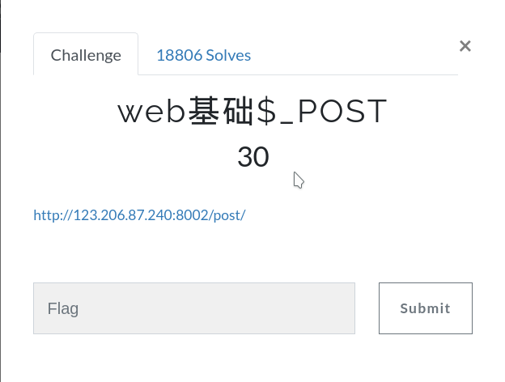
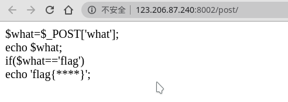
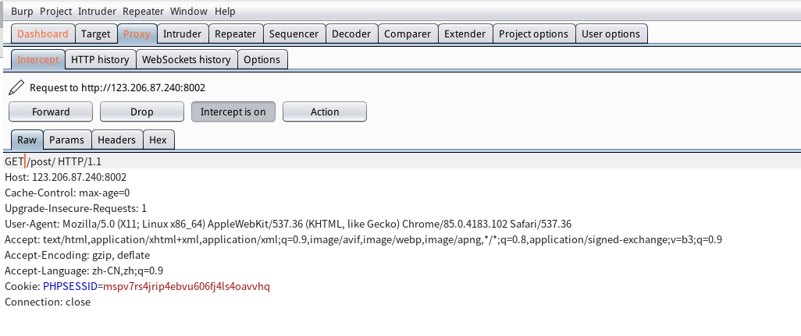
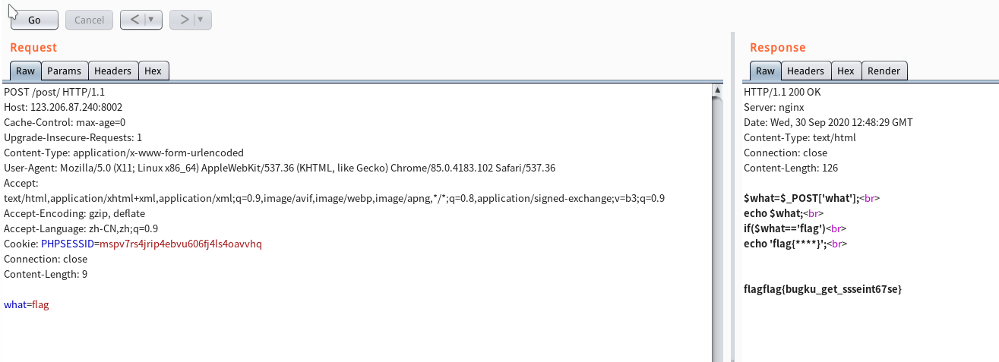

# web基础$_POST

## 进入题目

## 过程

**这段代码的意思是**

**接收一个POST请求**

**要求what等于flag**

**bp抓个包**

**修改请求头**

**把GET改为POST**

**添加POST请求头**

Content-Type: application/x-www-form-urlencoded

**在添加内容**

what=flag

## flag

