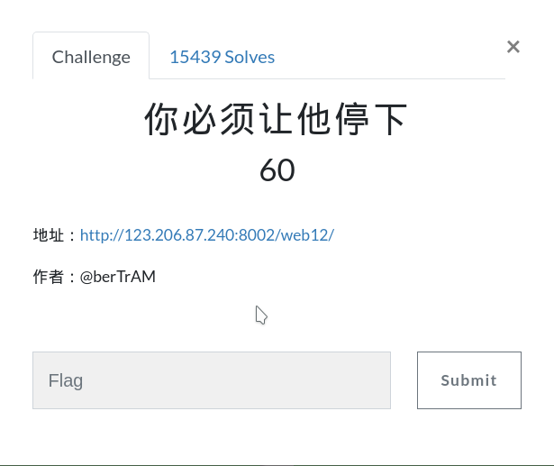

# 你必须让他停下来

## 进入题目

## 解题过程
**看到网页一直在转跳
**查看源码

**看到图片标签里有注释flag is hert
这是在说flag在图片的标签里
**然后我在打开了一次源码发现每次转跳的时候
**图片就会不一样

**估计flag就在某个图片的标签里
**这样重复看源码效率太慢了
**用bp抓包
**一直重发到10.jpg的时候flag出现了（我不会说其实是我刚好抓到有flag的包的:D）

## flag

