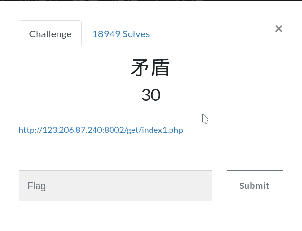
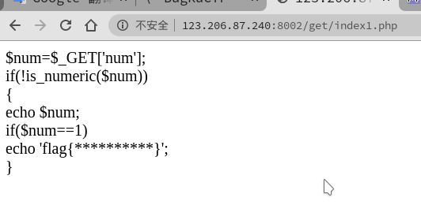
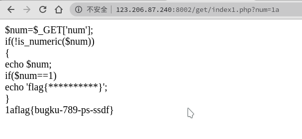

# 矛盾

## 进入题目

## 过程

**得到源码**
**源码的意思是**
**GET请求一个num的变量**
**然后用is_numeric()函数检测$num是否为数字或者是数字字符串**
**然后is_numeric()函数前面有一个!这个就使$num不能是数字或者是数字字符串了**
**再接下来就是如果$num等于1的话就打印flag**
**知道意思之后就可以构造参数了**
**?num=1a**
**得到flag**

## flag

