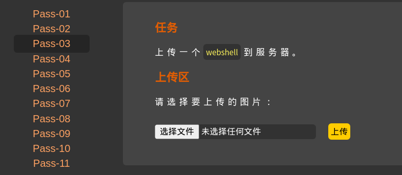
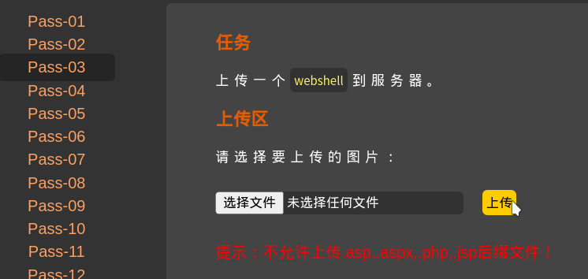
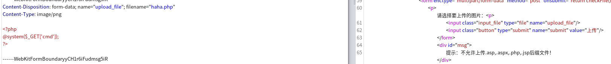
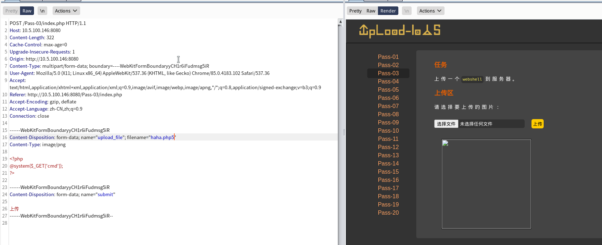
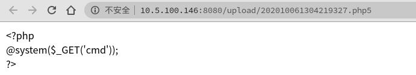
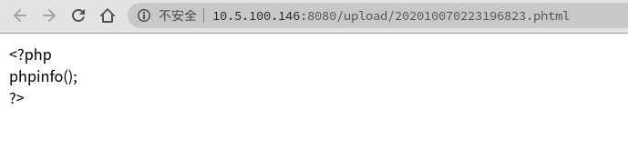
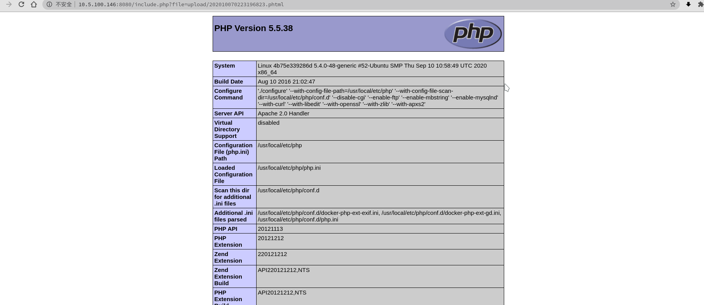

# 第三关
# Pass-3



试着上传一个php文件看看有什么回显

无法上传.asp、aspx、.php、.jsp的后缀文件
先用老方法试一下
把php文件改名成为png文件的后缀

然后用bp抓包

emmmmm
查看源码


```php
$is_upload = false;
$msg = null;
if (isset($_POST['submit'])) {
    if (file_exists(UPLOAD_PATH)) {
        $deny_ext = array('.asp','.aspx','.php','.jsp');
        $file_name = trim($_FILES['upload_file']['name']);
        $file_name = deldot($file_name);//删除文件名末尾的点
        $file_ext = strrchr($file_name, '.');
        $file_ext = strtolower($file_ext); //转换为小写
        $file_ext = str_ireplace('::$DATA', '', $file_ext);//去除字符串::$DATA
        $file_ext = trim($file_ext); //收尾去空
    if(!in_array($file_ext, $deny_ext)) {
        $temp_file = $_FILES['upload_file']['tmp_name'];
        $img_path = UPLOAD_PATH.'/'.date("YmdHis").rand(1000,9999).$file_ext;            
        if (move_uploaded_file($temp_file,$img_path)) {
             $is_upload = true;
        } else {
            $msg = '上传出错！';
        }
    } else {
        $msg = '不允许上传.asp,.aspx,.php,.jsp后缀文件！';
    }
} else {
    $msg = UPLOAD_PATH . '文件夹不存在,请手工创建！';
}
```
}
源码用strrchr这个函数来确定上传的后缀名是否是黑名单里的后缀出现在文件名里
然后还用strtolower来转换大写，也切断了使用大写后缀名来绕过的方法
还上传之后更改文件的名
emmmmm
源码里只过滤了黑名单里的后缀名，但是php是脚本语言只要声明了在哪都可以执行
还有一些php自带的后缀名
	php4
	php5
	php3
	php2
	php1
	phtml
也可以使用
	html
	htm
这些后缀名可以绕过


上传成功

查看上传的码

发现不解析php5后缀的文件
换个别的后缀名试试

发现还是不解析
没办法了只能使用这个平台自己的文件包含去执行了

可以解析了


