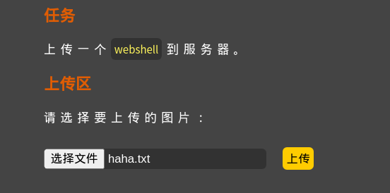
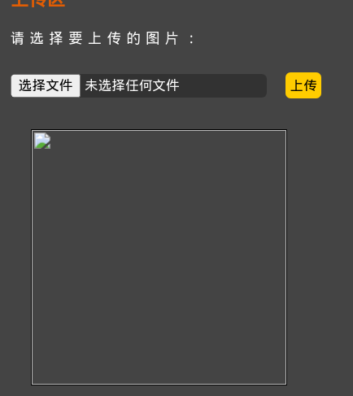
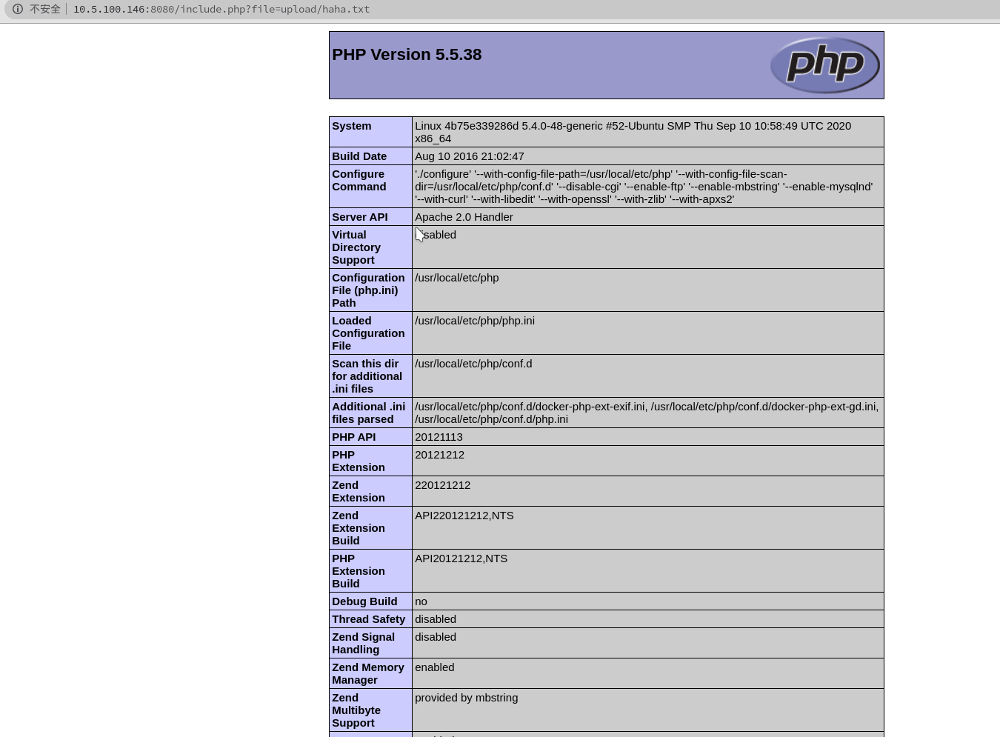
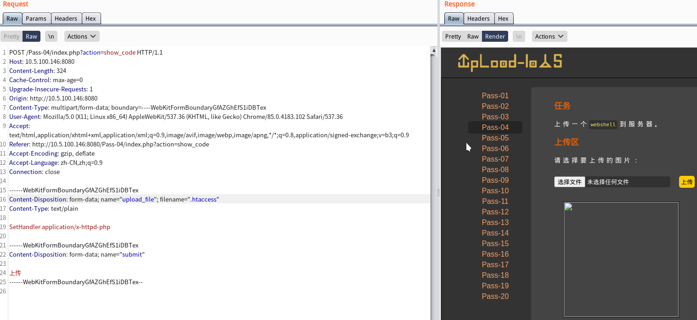
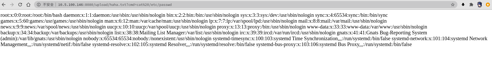

# 第四关
# Pass-04

查看源码
	$is_upload = false;
	$msg = null;
	if (isset($_POST['submit'])) {
	    if (file_exists(UPLOAD_PATH)) {
	        $deny_ext = array(".php",".php5",".php4",".php3",".php2","php1",".html",".htm",".phtml",".pht",".pHp",".pHp5",".pHp4",".pHp3",".pHp2","pHp1",".Html",".Htm",".pHtml",".jsp",".jspa",".jspx",".jsw",".jsv",".jspf",".jtml",".jSp",".jSpx",".jSpa",".jSw",".jSv",".jSpf",".jHtml",".asp",".aspx",".asa",".asax",".ascx",".ashx",".asmx",".cer",".aSp",".aSpx",".aSa",".aSax",".aScx",".aShx",".aSmx",".cEr",".sWf",".swf");
	        $file_name = trim($_FILES['upload_file']['name']);
	        $file_name = deldot($file_name);//删除文件名末尾的点
	        $file_ext = strrchr($file_name, '.');
	        $file_ext = strtolower($file_ext); //转换为小写
	        $file_ext = str_ireplace('::$DATA', '', $file_ext);//去除字符串::$DATA
	        $file_ext = trim($file_ext); //收尾去空
	
	        if (!in_array($file_ext, $deny_ext)) {
	            $temp_file = $_FILES['upload_file']['tmp_name'];
	            $img_path = UPLOAD_PATH.'/'.date("YmdHis").rand(1000,9999).$file_ext;
	            if (move_uploaded_file($temp_file, $img_path)) {
	                $is_upload = true;
	            } else {
	                $msg = '上传出错！';
	            }
	        } else {
	            $msg = '此文件不允许上传!';
	        }
	    } else {
	        $msg = UPLOAD_PATH . '文件夹不存在,请手工创建！';
	    }
	}

这里有些狠，把所有的后缀名都过滤了但是没过滤txt的
可以使用自带的包含上传来解析了

过关～:D

觉得有些太简单了，就去查了查网上大佬做的

发现还有一种解法

新知识GET～

通过之前的上传的phpinfo()知道这个平台是用的Apache服务
然后过滤的黑名单里没有过滤掉.htaccess
这个文件

>.htaccess文件是Apache服务器中的一个配置文件，它负责相关的目录下的网页配置。通过.htaccess文件，可以实现：网页301重定向、自定义404错误页面、改变文件扩展名、允许/阻止特定的用户或者目录的访问、禁止目录列表、配置默认文档等功能IIS平台上不存在该文件，该文件默认开启，启用和关闭在httpd.conf文件中配置

使用抓包修改文件名字为.htaccess
并添加SetHandler application/x-httpd-php
这句话的意思是所有文件都当成php文件来解析

上传成功

然后再上传一个txt格式的文件，这样就不用用平台自带的include文件去包含了
就会直接解析了

过关～

