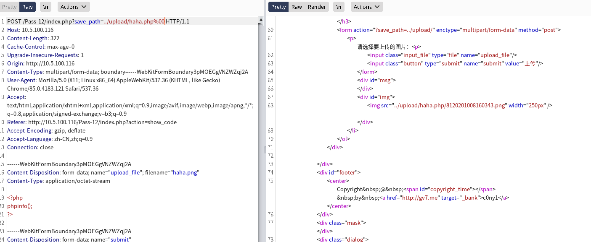
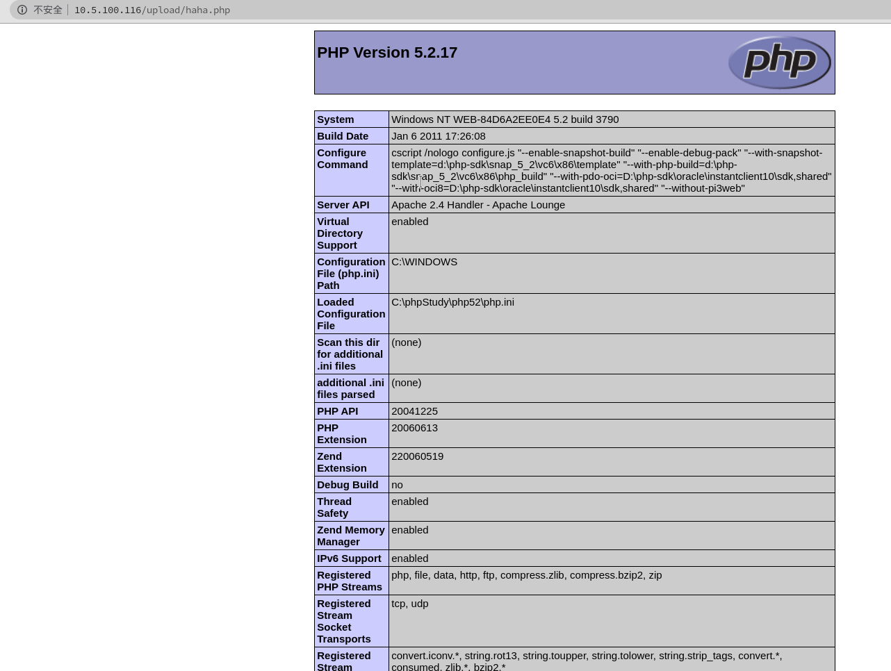

# 第十二关
# Pass-12

第十二关
查看源码
```php
$is_upload = false;
$msg = null;
if(isset($_POST['submit'])){
    $ext_arr = array('jpg','png','gif');
    $file_ext = substr($_FILES['upload_file']['name'],strrpos($_FILES['upload_file']['name'],".")+1);
    if(in_array($file_ext,$ext_arr)){
        $temp_file = $_FILES['upload_file']['tmp_name'];
        $img_path = $_GET['save_path']."/".rand(10, 99).date("YmdHis").".".$file_ext;

        if(move_uploaded_file($temp_file,$img_path)){
            $is_upload = true;
        } else {
            $msg = '上传出错！';
        }
    } else{
        $msg = "只允许上传.jpg|.png|.gif类型文件！";
    }
}
```
第十二关呢是直接用白名单了
除了jpg和png还有gif以外的后缀名文件都被过滤了
有几个新函数
substr、strrpos
substr 返回字符串的子串
strrpos 计算指定字符串在目标字符串中最后一次出现的位置

重点是这个substr还有源码中的$img_path = $img_path = $\_GET['save_path']."/".rand(10, 99).date("YmdHis").".".$file_ext;

虽然用了白名单但是这里调用的语句有逻辑漏洞，它是把上传的文件名去和路径拼接去上传成为地址的，所以可以自己定义上传的地址，然后用url编码的空值去截断%00




过关啦～～～

