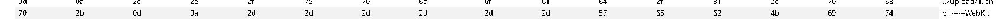
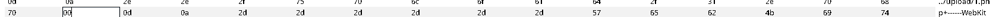
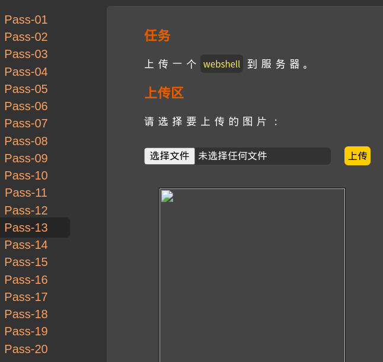

# 第十三关
# Pass-13

第十三关的源码

```php
$is_upload = false;
$msg = null;
if(isset($_POST['submit'])){
    $ext_arr = array('jpg','png','gif');
    $file_ext = substr($_FILES['upload_file']['name'],strrpos($_FILES['upload_file']['name'],".")+1);
    if(in_array($file_ext,$ext_arr)){
        $temp_file = $_FILES['upload_file']['tmp_name'];
        $img_path = $_POST['save_path']."/".rand(10, 99).date("YmdHis").".".$file_ext;

        if(move_uploaded_file($temp_file,$img_path)){
            $is_upload = true;
        } else {
            $msg = "上传失败";
        }
    } else {
        $msg = "只允许上传.jpg|.png|.gif类型文件！";
    }
}
```
第十三关跟十二关的源码基本相同
只是把拼接的请求改为了$\_POST请求
$\_POST请求不会直接解析url编码，需要自己去修改
随便用一个字符串就行，我用的是+这个字符窜
然后在hex头里找到路径的位置

+号的编码在这里是2b,把这个改为00
就行了


过关～:D

