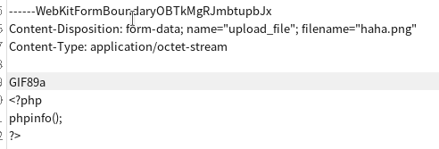
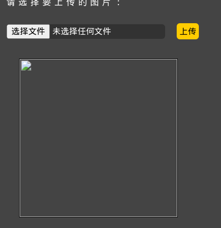
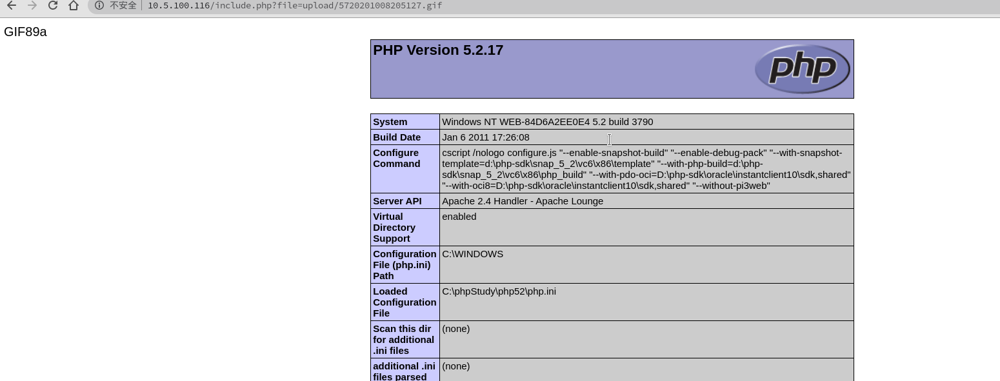

# 第十五关
# Pass-15

第十五关的源码
```php
function isImage($filename){
    $types = '.jpeg|.png|.gif';
    if(file_exists($filename)){
        $info = getimagesize($filename);
        $ext = image_type_to_extension($info[2]);
        if(stripos($types,$ext)>=0){
            return $ext;
        }else{
            return false;
        }
    }else{
        return false;
    }
}

$is_upload = false;
$msg = null;
if(isset($_POST['submit'])){
    $temp_file = $_FILES['upload_file']['tmp_name'];
    $res = isImage($temp_file);
    if(!$res){
        $msg = "文件未知，上传失败！";
    }else{
        $img_path = UPLOAD_PATH."/".rand(10, 99).date("YmdHis").$res;
        if(move_uploaded_file($temp_file,$img_path)){
            $is_upload = true;
        } else {
            $msg = "上传出错！";
        }
    }
}
```
遇到俩新函数
getimagesize 获取图片大小
image_type_to_extension 取得图像类型的文件后缀名

OK,这一次使用这俩新函数去判断是否是图片了
不过这还是检测首俩字节是否是图片
这次还是可以用图片码去绕过




上传成功


过关～:>
