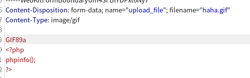

# 第十六关
# Pass-16

第十六关源码

```php
function isImage($filename){
    //需要开启php_exif模块
    $image_type = exif_imagetype($filename);
    switch ($image_type) {
        case IMAGETYPE_GIF:
            return "gif";
            break;
        case IMAGETYPE_JPEG:
            return "jpg";
            break;
        case IMAGETYPE_PNG:
            return "png";
            break;    
        default:
            return false;
            break;
    }
}

$is_upload = false;
$msg = null;
if(isset($_POST['submit'])){
    $temp_file = $_FILES['upload_file']['tmp_name'];
    $res = isImage($temp_file);
    if(!$res){
        $msg = "文件未知，上传失败！";
    }else{
        $img_path = UPLOAD_PATH."/".rand(10, 99).date("YmdHis").".".$res;
        if(move_uploaded_file($temp_file,$img_path)){
            $is_upload = true;
        } else {
            $msg = "上传出错！";
        }
    }
}
```

新函数exif_imagetype

判断是一个图片的类型

解法和上一个一样不过需要把content-Type的值给改为图片的值




