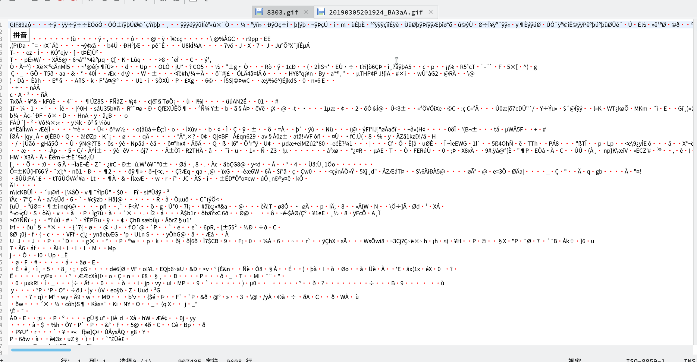
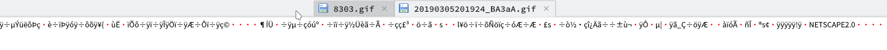
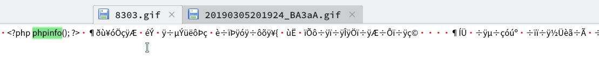
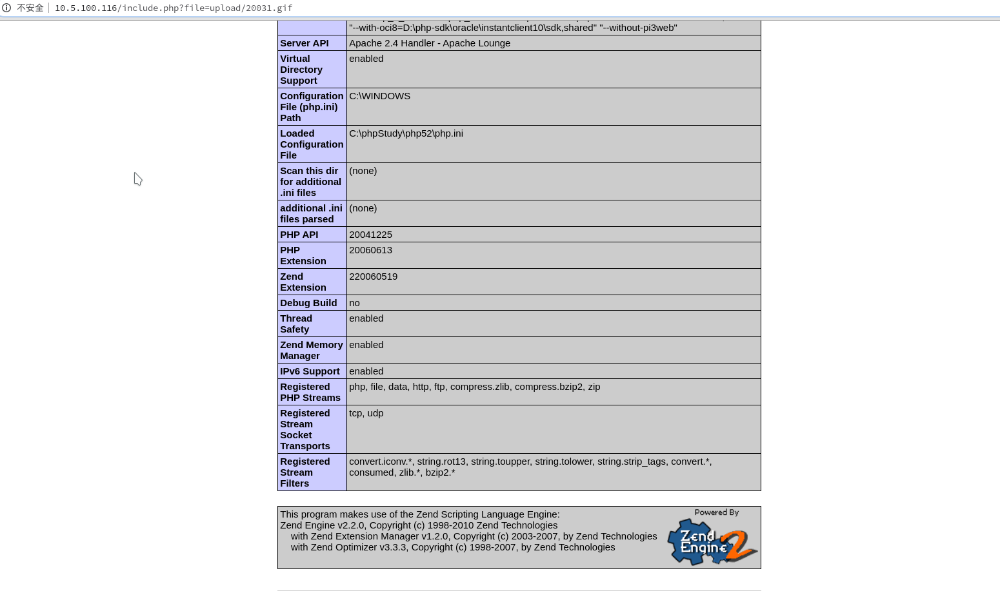

# 第十七关
# Pass-17

第十七关源码

```php
$is_upload = false;
$msg = null;
if (isset($_POST['submit'])){
    // 获得上传文件的基本信息，文件名，类型，大小，临时文件路径
    $filename = $_FILES['upload_file']['name'];
    $filetype = $_FILES['upload_file']['type'];
    $tmpname = $_FILES['upload_file']['tmp_name'];

    $target_path=UPLOAD_PATH.'/'.basename($filename);

    // 获得上传文件的扩展名
    $fileext= substr(strrchr($filename,"."),1);

    //判断文件后缀与类型，合法才进行上传操作
    if(($fileext == "jpg") && ($filetype=="image/jpeg")){
        if(move_uploaded_file($tmpname,$target_path)){
            //使用上传的图片生成新的图片
            $im = imagecreatefromjpeg($target_path);

            if($im == false){
                $msg = "该文件不是jpg格式的图片！";
                @unlink($target_path);
            }else{
                //给新图片指定文件名
                srand(time());
                $newfilename = strval(rand()).".jpg";
                //显示二次渲染后的图片（使用用户上传图片生成的新图片）
                $img_path = UPLOAD_PATH.'/'.$newfilename;
                imagejpeg($im,$img_path);
                @unlink($target_path);
                $is_upload = true;
            }
        } else {
            $msg = "上传出错！";
        }

    }else if(($fileext == "png") && ($filetype=="image/png")){
        if(move_uploaded_file($tmpname,$target_path)){
            //使用上传的图片生成新的图片
            $im = imagecreatefrompng($target_path);

            if($im == false){
                $msg = "该文件不是png格式的图片！";
                @unlink($target_path);
            }else{
                 //给新图片指定文件名
                srand(time());
                $newfilename = strval(rand()).".png";
                //显示二次渲染后的图片（使用用户上传图片生成的新图片）
                $img_path = UPLOAD_PATH.'/'.$newfilename;
                imagepng($im,$img_path);

                @unlink($target_path);
                $is_upload = true;               
            }
        } else {
            $msg = "上传出错！";
        }

    }else if(($fileext == "gif") && ($filetype=="image/gif")){
        if(move_uploaded_file($tmpname,$target_path)){
            //使用上传的图片生成新的图片
            $im = imagecreatefromgif($target_path);
            if($im == false){
                $msg = "该文件不是gif格式的图片！";
                @unlink($target_path);
            }else{
                //给新图片指定文件名
                srand(time());
                $newfilename = strval(rand()).".gif";
                //显示二次渲染后的图片（使用用户上传图片生成的新图片）
                $img_path = UPLOAD_PATH.'/'.$newfilename;
                imagegif($im,$img_path);

                @unlink($target_path);
                $is_upload = true;
            }
        } else {
            $msg = "上传出错！";
        }
    }else{
        $msg = "只允许上传后缀为.jpg|.png|.gif的图片文件！";
    }
}
```

这一次使用了imagecreatefromjpg、imagecreatefromgif、imagecreatefrompng
等函数来进行检查是否是图片，然后再渲染图片里的代码，生成新的图片和图片名之后再保存到路径里


但是这次这个渲染呢只渲染一部分，会把放在结尾的一句话木马给渲染掉，这时候可以通过上传一个图片，然后再把平台返回的图片给下下来进行对比，看看渲染了哪一部分没有渲染哪一部分，然后在没有渲染的地方插入木马就可以了






过关:>

