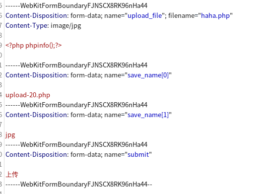
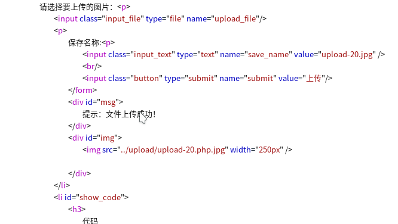
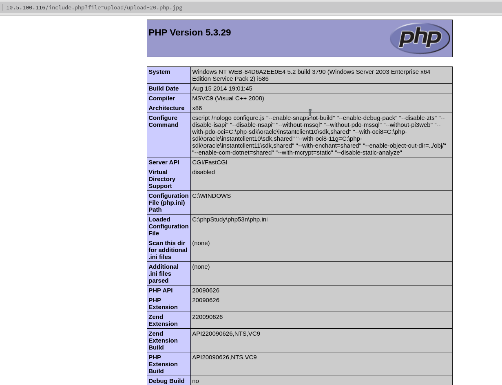

# 第二十一关
# Pass-21

第二十一关源码
```php
$is_upload = false;
$msg = null;
if(!empty($_FILES['upload_file'])){
    //检查MIME
    $allow_type = array('image/jpeg','image/png','image/gif');
    if(!in_array($_FILES['upload_file']['type'],$allow_type)){
        $msg = "禁止上传该类型文件!";
    }else{
        //检查文件名
        $file = empty($_POST['save_name']) ? $_FILES['upload_file']['name'] : $_POST['save_name'];
        if (!is_array($file)) {
            $file = explode('.', strtolower($file));
        }

        $ext = end($file);
        $allow_suffix = array('jpg','png','gif');
        if (!in_array($ext, $allow_suffix)) {
            $msg = "禁止上传该后缀文件!";
        }else{
            $file_name = reset($file) . '.' . $file[count($file) - 1];
            $temp_file = $_FILES['upload_file']['tmp_name'];
            $img_path = UPLOAD_PATH . '/' .$file_name;
            if (move_uploaded_file($temp_file, $img_path)) {
                $msg = "文件上传成功！";
                $is_upload = true;
            } else {
                $msg = "文件上传失败！";
            }
        }
    }
}else{
    $msg = "请选择要上传的文件！";
}
```

这一关使用白名单制过滤
```php
$allow_type = array('image/jpeg','image/png','image/gif');
    if(!in_array($_FILES['upload_file']['type'],$allow_type)
```
这一句代码是检测请求头里的Content-Type:的值是否是image/jpeg等图片值

所以可以修改Content-Type的值为image/png即可

然后
```php
        $file = empty($_POST['save_name']) ? $_FILES['upload_file']['name'] : $_POST['save_name'];
        if (!is_array($file)) {
            $file = explode('.', strtolower($file));
        }

        $ext = end($file);
        $allow_suffix = array('jpg','png','gif');
        if (!in_array($ext, $allow_suffix)) {
            $msg = "禁止上传该后缀文件!";
        }else{
            $file_name = reset($file) . '.' . $file[count($file) - 1];
            $temp_file = $_FILES['upload_file']['tmp_name'];
            $img_path = UPLOAD_PATH . '/' .$file_name;
            if (move_uploaded_file($temp_file, $img_path)) {
                $msg = "文件上传成功！";
                $is_upload = true;
            } else {
                $msg = "文件上传失败！";
            }
        }
    }
}else{
    $msg = "请选择要上传的文件！";
}
```

这里使用的exploade这个值来在命名的图片后面都加上jpg、png、gif等后缀名
但是这个函数，只能执行一次，如果是数组的话只会对数组中的最后一个值进行执行
所以可以使用数组绕过

这样构造

然后上传

然后再用文件包含漏洞包含执行


过关～～～


